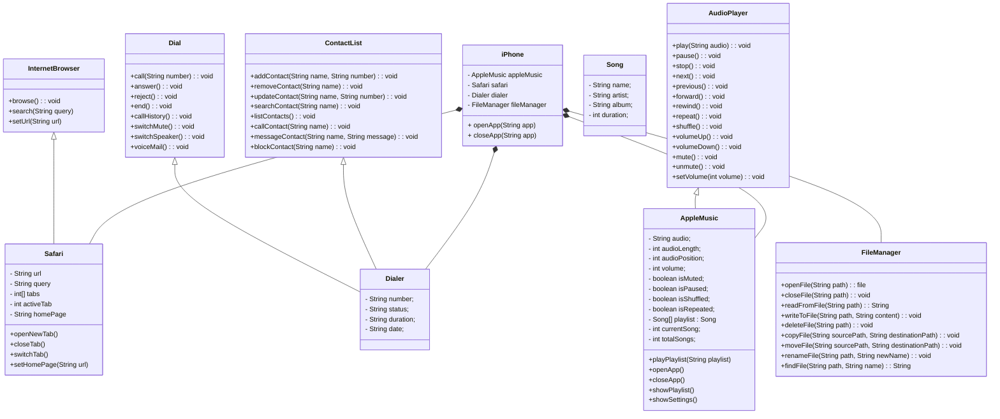

# Desafio Java Poo - iPhone

## Descrição
De acordo com o que foi exibido no vídeo de lançamento do iPhone, o desafio era criar uma diagramação e as classes de java que representassem o iPhone, seus apps e funcionalidades.

Foram criados ao todo 3 aplicativos:
- Dialer
- Safari
- AppleMusic

## Diagramação

